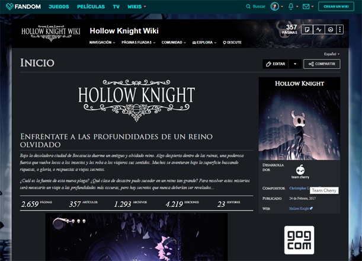
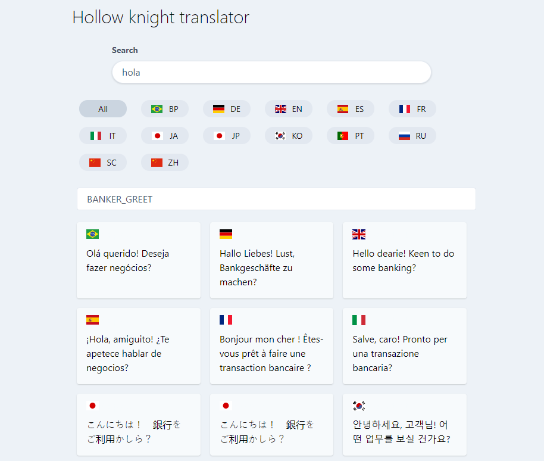
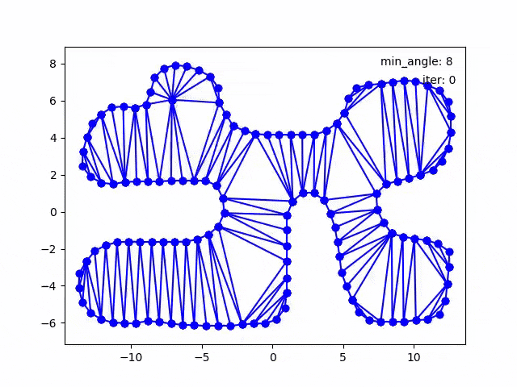

Here are some of my personal projects.

### Hollow Knight

#### [Hollow Knight Wikia](https://hollowknight.fandom.com/es/wiki/Hollow_Knight_Wiki)

Loved that game and decided to translate the english wikia into spanish.

#### [Hollow Knight Translator](/hollow-knight-translator)

Tool to search of in-game translations.

### [Final Degree Project](https://github.com/xiangchen96/Automatic-mesh-generation) (University)

Generating quality 2D polygon meshes using Restricted [Delaunay Triangulations](https://en.wikipedia.org/wiki/Delaunay_triangulation).

